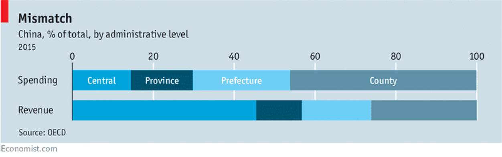
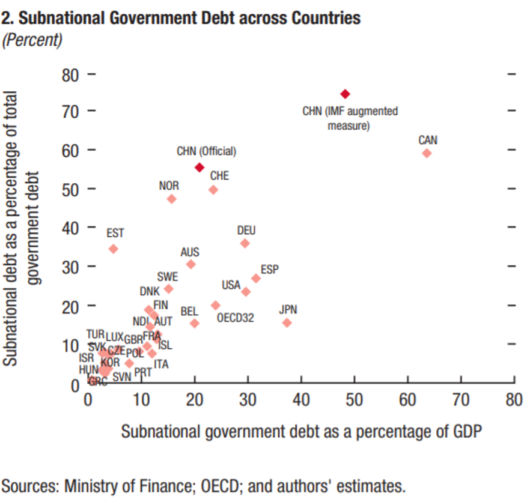
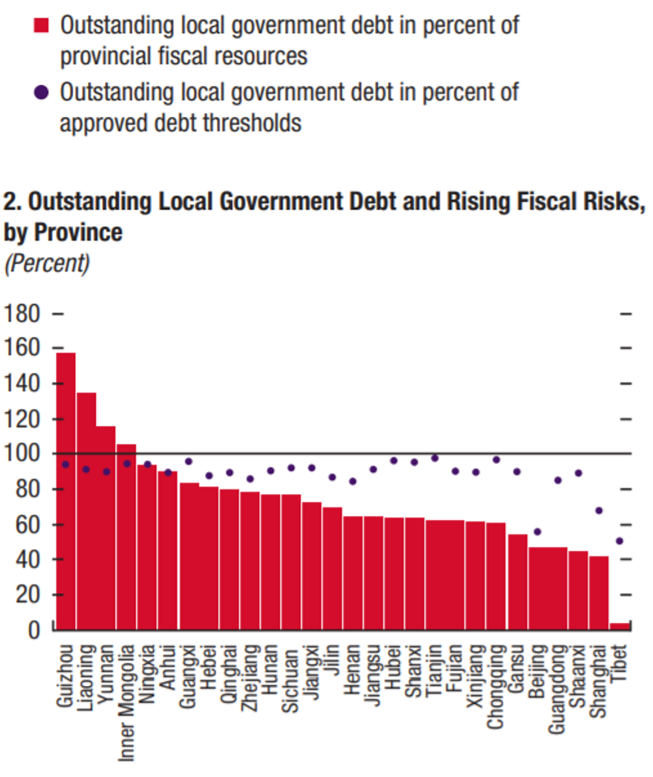
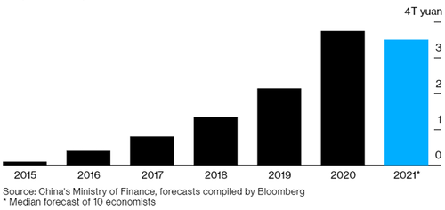
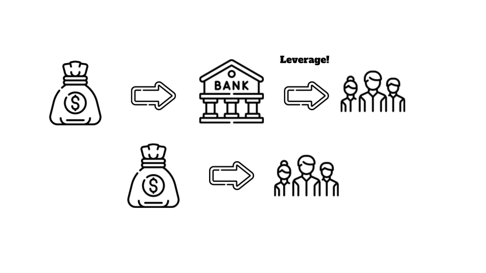
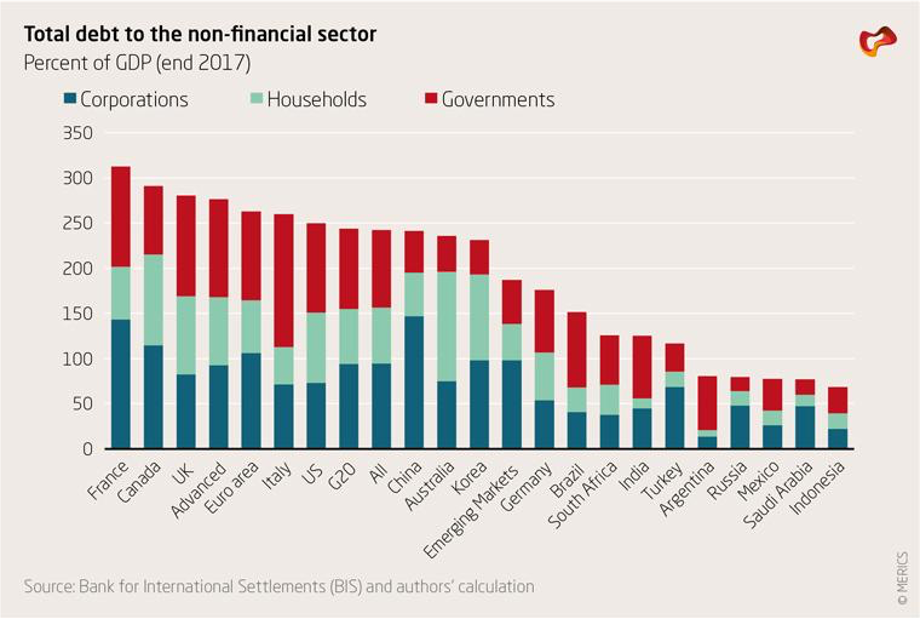

```{r setup, include=FALSE,warning=FALSE,message=FALSE}
options(htmltools.dir.version = FALSE)
knitr::opts_chunk$set(
  message = FALSE,
  warning = FALSE,
  dev ='svglite',
  cache = TRUE,
  fig.align = "center",
  fig.width = 9,
  fig.height = 5,
  echo = F,
  dev.args = list(bg = 'transparent')
)
# define vars
om = par("mar")
lowtop = c(om[1],om[2],0.1,om[4])
overwrite = FALSE
library(tidyverse)
library(ggplot2)
library(grid)
library(pBrackets) 
library(emo)
library(viridis)
library(svglite)
library(readxl)
library(reshape2)
library(RColorBrewer)
library(cowplot)
set.seed(1234)
```

```{r xaringan-themer, include=FALSE, warning=FALSE}
library(xaringanthemer)
style_solarized_light()
```

# Outline

* Distribution and evolution of China's debt

* Public debt

* Household debt

* Local Government Financing Vehicles

* Corporate debt and State Owned Enterprises

---

# Distribution of China's debt

```{r}
piedata <- data.frame("category" = c('Household', 'Government', 'Corporate'),
                   "amount" = c(62.2, 45.6, 332.8))

ggplot(piedata, aes(x="", y=amount, fill=category)) +
  geom_bar(stat="identity", width=1) +
  coord_polar("y", start=0) +  theme_classic() +
  theme(axis.line = element_blank(),
        axis.text = element_blank(),
        axis.ticks = element_blank(),
        panel.background = element_rect(fill = "transparent"),
        legend.background = element_rect(fill = "transparent"),
        plot.background = element_rect(fill = "transparent", color = NA)) +
  labs(x = NULL, y = NULL, fill = NULL, caption = "Source: Center for National Balance Sheets") +
  scale_fill_manual(values=c("#1B9E77", "#D95F02", "#7570B3"))
```

---

# Evolution of different debts

```{r}
imf_dm_export_20210316_5 <- read_excel("~/Downloads/imf-dm-export-20210316-5.xls")
imf_dm_export_20210316_4 <- read_excel("~/Downloads/imf-dm-export-20210316-4.xls")
imf_dm_export_20210316_3 <- read_excel("~/Downloads/imf-dm-export-20210316-3.xls")


disttime <- melt(imf_dm_export_20210316_5, "Nonfinancial corporate debt, loans and debt securities (Percent of GDP)")
disttimehh <- melt(imf_dm_export_20210316_4, "Household debt, loans and debt securities (Percent of GDP)")
disttimegov <- melt(imf_dm_export_20210316_3, "General Government Debt (Percent of GDP)")


disttime$year <- lubridate::ymd(disttime$variable, truncated = 2L)
disttimehh$year <- lubridate::ymd(disttimehh$variable, truncated = 2L)
disttimegov$year <- lubridate::ymd(disttimegov$variable, truncated = 2L)


for (i in 1:nrow(disttime)){
  disttime$debttype[i] <- "Corporate"
}

for (i in 1:nrow(disttimehh)){
  disttimehh$debttype[i] <- "Household"
}

for (i in 1:nrow(disttimegov)){
  disttimegov$debttype[i] <- "Government"
}

names(disttime)[1] <- c("Country")
names(disttimehh)[1] <- c("Country")
names(disttimegov)[1] <- c("Country")

disttime <- disttime %>% select(-variable)
disttimehh <- disttimehh %>% select(-variable)
disttimegov <- disttimegov %>% select(-variable)


longshitwithtype <- rbind(disttime, disttimehh, disttimegov)

longshitwithtype$Country[longshitwithtype$Country == "China, People's Republic of"] <- "China"

#Bars
ggplot(longshitwithtype, aes( x=year, y=value)) + 
  geom_line(stat="identity") + facet_grid(debttype~Country) +
  theme_minimal() + theme(axis.title.x = element_blank()) +
  theme(legend.position="bottom") +
  labs(title = "Debt to GDP ratio", caption = "Source: IMF", color = "My Legend Title No. 2")+
  ylab("Percent of GDP") + 
  scale_x_date(limits = as.Date(c("1995-01-01","2020-01-01")))+
  scale_fill_manual(values=c("#1B9E77", "#D95F02", "#7570B3"), name = "Type of debt")
```

---

# <center>Public debt</center>

* Relatively low

* Barely foreign-denominated

* External debt position 

* Foreign Currency Reserves 

* Interest rate

* Fiscal balance vs growth rate

---
# Putting things into perspective

```{r}
API_DT_DOD_DECT_GN_ZS_DS2_en_csv_v2_2062438 <- read_csv("~/Downloads/API_DT/API_DT.DOD.DECT.GN.ZS_DS2_en_csv_v2_2062438.csv", 
                                                        skip = 3)

wb_wide <- API_DT_DOD_DECT_GN_ZS_DS2_en_csv_v2_2062438 %>% select(-`Country Code`, -`Indicator Name`, -`Indicator Code`)

wb_long <- melt(wb_wide, id="Country Name")

wb_long$year <- lubridate::ymd(wb_long$variable, truncated = 2L)

ggplot(wb_long, aes( x=year, y=value, colour=`Country Name`, group=`Country Name` )) + 
  geom_line(data=wb_long[wb_long$`Country Name` %in% c("China", "Thailand"),]) + scale_x_date(limits = as.Date(c("1981-01-01","2020-01-01"))) +
  scale_color_brewer(palette = "Dark2", name = "Country") +
  theme_minimal() + theme(axis.title.x = element_blank()) + ylab("Percent of GNI") + 
  labs(title = "External debt stock as percentage of GNI", caption = "Source: World Bank")
```
        
---
# <center>Household debt</center>

* Mortgages not put in financial products

* Typically held by issuers until maturity

* 20~30% put down as payment

---

# Development of debts

```{r}
CNBS_e4_b8_ad_e5_9b_bd_e6_9d_a0_e6_9d_86_e7_8e_87_e6_95_b0_e6_8d_ae <- read_excel("~/Downloads/CNBS.xlsx")

test_data_long <- melt(CNBS_e4_b8_ad_e5_9b_bd_e6_9d_a0_e6_9d_86_e7_8e_87_e6_95_b0_e6_8d_ae, id="Period")

ggplot(test_data_long, aes( x=Period, y=value, colour=variable, group=variable )) + 
  geom_line() + scale_color_brewer(palette = "Dark2", name = "Type of debt") +
  theme_minimal() + theme(axis.title.x = element_blank()) + ylab("Percent of GDP") +
  labs(title = "Chinas debt to GDP ratio", caption = "Source: Center for National Balance Sheets")+
  theme(rect = element_rect(fill = "transparent"))
```


---

# Household debt

```{r}
#Importing the IMF data

imf_dm_export_20210314 <- read_excel("~/Downloads/imf-dm-export-20210314.xls")

imf_long <- melt(imf_dm_export_20210314, id="Householddebt")

imf_long$year <- lubridate::ymd(imf_long$variable, truncated = 2L)

imf_long$Householddebt[imf_long$Householddebt == "China, People's Republic of"] <- "China"


ggplot(imf_long, aes( x=year, y=value, colour=Householddebt, group=Householddebt )) + 
  geom_line() + scale_color_brewer(palette = "Dark2", name = "Country") +
  theme_minimal() + theme(axis.title.x = element_blank()) + ylab("Percent of GDP") + 
  labs(title = "Household debt to GDP ratio", caption = "Source: IMF")
```

---

# Consumer loans

* Have little collateral

* Traditional banks lack information on borrowers
  * Ant Group superseding in consumer loans

* P2P loans, Jiebei
  * In retreat

---

# <center>Local government financing vehicles</center>
<center>The “Augmented” Fiscal Deficit</center>
<center>of Local Governments</center>

---

# Why?

* 1994 fiscal reform
* Local governments have to spend much more than they collect



* Transfers from Beijing necessary
* Official borrowing requires prior approval from Beijing 

---

# How?


---

# Problems

* Transparency: ‘Augmented’ fiscal deficit (IMF, 2019)
  * official public debt (approx. 40% of GDP)
	* off-books public debt (approx. 30% of GDP)
* Higher interest rates
* Unsustainable business model
  * Short-term loans for long-term projects 
  * Not enough liquidity to service debt, so based on land “sales”
* Central government loses control
* Financial risk? 
  * Moody’s (2019): 39% of total outstanding corporate bonds

---

# Financial risk?

.pull-left[


]
.pull-right[


]


---

# Central government responses

* 2014
  * Ban on new LGFV debt
  * New regulated PPPs
  * Quota for official borrowing instead of prior approval
  * Swapping program to bonds 

  But alternative off-the-books borrowing still went up!
* 2018-2019
  * Allow LGFV defaults   ➡️   Interest rates    ⬆️    Borrowing   ⬇️
  * Swapping program to cheap long-term loans by the China Development Bank

---

# Central government responses

* 2020
  * Increased quota
  * Increased central government transfers to service local debt
* 2021
  * Decreased quota


---

# <center>Corporate debt</center>

---

# Market-based vs Bank-based Financial System



---

# China has a bank-based system and this increases systemic risk

* Systemic risk may be defined as a disruption to the flow of financial services that is (i) caused by an impairment of all or parts of the financial system; and (ii) has the potential to have serious negative consequences for the real economy (BIS, FSB and IMF, 2009).

* A paper written by Houben & Bats (2017) writes about the increased risks in a bank-based system like China. 

  * Leverage
  * Asset-liability mismatch (short-term liabilities vs long-term assets)
  * Intermediation chains


---

# Global Recession 

* Concerns for growth (exports) 

* Two Choices:
  * FX depreciation
  * Keynesian stimulus 

* Extra capital for banks 

---

# Non-financial debt-to-GDP ratio

```{r}
ggplot(test_data_long, aes( x=Period, y=value)) + 
  geom_line(data=test_data_long[test_data_long$variable %in% c("Non financial sector"),]) + scale_color_brewer(palette = "Dark2", name = "Type of debt") +
  theme_minimal() + theme(axis.title.x = element_blank()) + ylab("Percent of GDP") +
  labs(caption = "Source: Center for National Balance Sheets")+
  theme(rect = element_rect(fill = "transparent"))
```

---

# China’s corporate debt

* Chinese Corporate debt is one of the highest in the world

* After 2009 stimulus, it went from 93% of GDP to 116% and now to more than 150%.

* ⅓ of the debt is local government debt and ⅔ is from SOEs to state-owned banks

---



---

# What are the problems

* NPLs and the balance sheets

* Possibility of shocks

* High debt-servicing ratio

* The rise of wealth management products (WMPs)

---

# Net Debt / EBITDA of 1189 mid-to large-cap companies


---
# Systemic risk? Not in the short-run. 

* China is still in a high growth period 

* High savings rate

* Most loans are made to SOEs by state-owned banks 

* Attempts to improve NPLs but costly (social costs)

---
# But future challenges!

* De-leveraging vs GDP 

* COVID-19

* Trade War 

* What happens with a big shock or low growth and higher interest rates? 

---

# Conclusion

* Safe mortgages, unsafe consumption

* LGFVs on retreat due to reform

* Corporate debt rising fast
  * Not a short term risk
  * But future challenges!
  
---

# <center>Thank you for listening</center>

---

# Bibliography

<p><small> Bart Carfagno, Allen Feng, and Logan Wright (2019, March 19. Local government debt: Running faster just to stand still. Rhodium Group. Downloaded from https://rhg.com/research/local-government-debt-lgfv-running-faster-just-to-stand-still/ on March 21st 2021. </small></p>

<small>Bloomberg (28 February 2021), “China Seen Cutting Local Government Bond Quota to Curb Debt”, accessible at www.bloomberg.com/news/articles/2021-02-28; </small>

<p><small> China's macro leverage ratio database. 2021. National Institution for Finance and Development</small></p>

---

<small>China’s government is cracking down on fintech. What does it want? (2021, march 13th). The Economist. https://www.economist.com/finance-and-economics/2021/03/13/chinas-government-is-cracking-down-on-fintech-what-does-it-want</small>

<small>D. Clarke (June 2016), “The Law of China's Local Government Debt Crisis: Local Government Financing Vehicles and Their Bonds”, GWU Law School Public Law Research Paper No. 2016-31, accessible at https://papers.ssrn.com/sol3/papers.cfm?abstract_id=2821331; </small>

<small>External debt stocks (% of GNI). 2021. World Bank, International Debt Statistics.</small>

<small>H. Jin & I. Rial (September 2016), “Regulating Local Government Financing Vehicles and Public-Private Partnerships in China”, IMF Working Paper, accessible at https://www.imf.org/external/pubs/ft/wp/2016/wp16187.pdf; </small>

---

<small>Jack Ma’s Ant defies pressure from Beijing to share more customer data. (2021, March 2nd.) Financial Times. https://www.ft.com/content/1651bc67-4112-4ce5-bf7a-d4ad7039e7c7</small>

<small>Kroeber, A. R. (2020). China's Economy: What Everyone Needs to Know®. Oxford University Press.</small>

<small>Mbaye, S., Moreno-Badia, M., and K. Chae. 2018. “Global Debt Database: Methodology and Sources,” IMF Working Paper, International Monetary Fund, Washington, DC</small>

<small>Moody’s (28 August 2019), “Offshore and onshore LGFV bond issuance to reach record highs in 2019”, accessible at www.moodys.com/research/408313; </small>

<small>Orlik, T., & Orlik, T. (2020). China: The Bubble that Never Pops. Oxford University Press, USA.</small>

---

<small>South China Morning Post (10 March 2021), “China’s debt-laden local governments urged not to ‘blindly expand’ post-coronavirus infrastructure projects”, accessible at www.scmp.com/economy/china-economy/article/3124855; </small>

<small>South China Morning Post (11 December 2020), “China debt: local government default risk grows as authorities struggle to repay credit”, accessible at www.scmp.com/economy/china-economy/article/3113377;</small>

<small>South China Morning Post (16 March 2021), “China debt: State Council says local governments must ‘tighten their belts’ and cut debt to reduce financial risks”, accessible at www.scmp.com/economy/china-economy/article/3125672; </small>

<small>South China Morning Post (19 May 2020), “China debt: how big is it and who owns it?”, accessible at www.scmp.com/economy/china-economy/article/3084979; </small>

---

<small>The Economist (11 March 2015), “China’s local government debt. Defusing a bomb”, accessible at www.economist.com/free-exchange/2015/03/11; </small>

<small>The Economist (16 November 2017), “What a debt crisis in the provinces says about governing China”, accessible at www.economist.com/china/2017/11/16;</small>

<small>The Economist (20 August 2016), “Augmented reality”, accessible at www.economist.com/finance-and-economics/2016/08/18;</small>

<small>The Economist (22 June 2019), “As growth slows, the spectre of local-government debt looms once more”, accessible at www.economist.com/finance-and-economics/2019/06/22;</small>

<small>W. Lam & W. Jingsen (2019), “Local Government Bonds”, in A. Schipke, M. Rodlauer & Z. Longmei (eds.), The Future of China’s Bond Market, IMF.</small>

---

# ‘Bad’ Banks

* Policy choice in response to 90s crisis 

* Transferral of NPLs 

* Japanese Lost Decade


